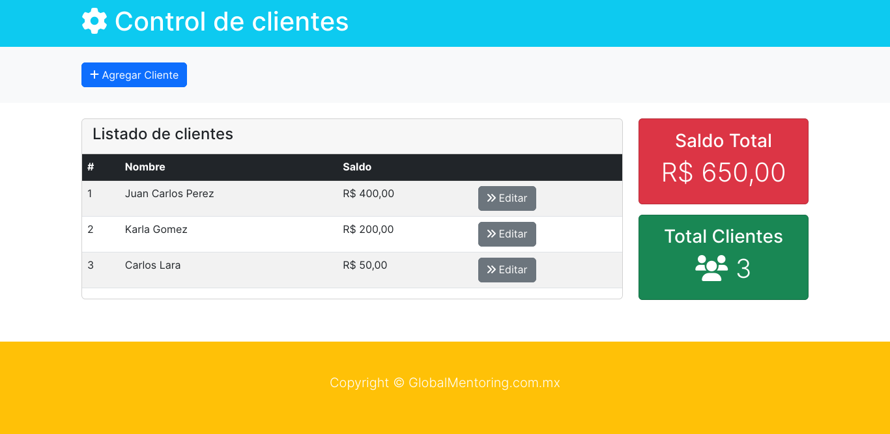
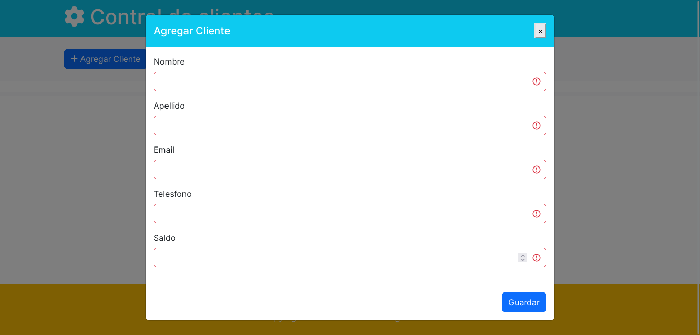
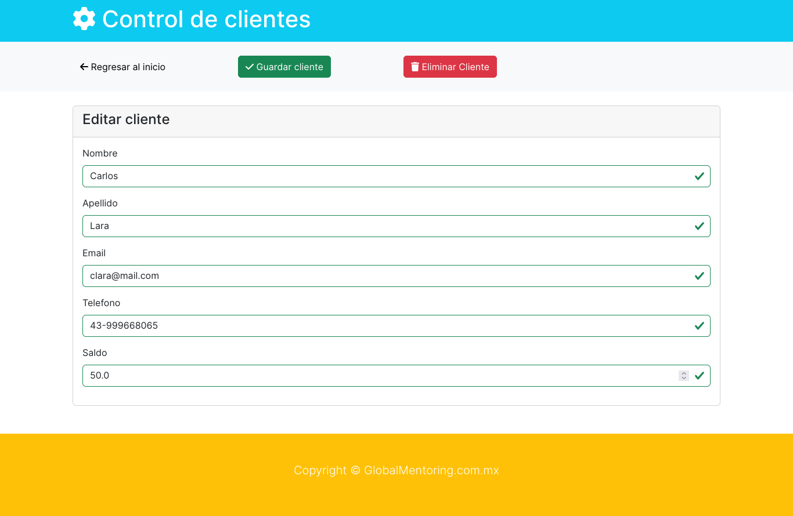

# Control clientes
Completion project of the Servlets and JSPs module for the Udemy Universidad Java course with Ing Ubaldo Acosta

## Screenshots

## Build in 

- Java 8 with Maven
- Servlets
- JSPs
- Bootstrap
- MySQL

## Author

- [@randymz10](https://github.com/randymz10)
- [LinkedIn](https://linkedin.com/in/randymz10)
- Email: randymz10@gmail.com
